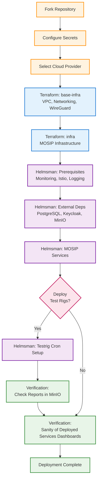

# Rapid Deployment Model - 1.2.0.3

## Overview
* **Rapid Deployment Model** designed to accelerate infrastructure setup, configuration, and rollout while maintaining reliability, scalability, and cloud neutrality.  
* This model enables faster and more consistent deployments of the complete MOSIP stack through **automation-first principles**, leveraging Infrastructure as Code (IaC), containerization, and continuous delivery.  

## Key Highlights
| Feature | Description |
|----------|--------------|
| **Rapid Deployment Model** | Fully automated approach using Infrastructure-as-Code (IaC) and modular cloud templates to provision and configure MOSIP environments efficiently. |
| **Continuous Deployment Model** | Integrated CI/CD pipelines automate build, version tagging, and deployment directly from MOSIP repositories for consistency and repeatability. |
| **Infrastructure as Code (IaC)** | Terraform and Ansible-based configurations define infrastructure, networking, and service parameters, enabling repeatable and auditable deployments. |
| **Cloud Agnostic Factory Model** | Modular factory design abstracts cloud dependencies — currently optimized for **AWS**, with extendable support for **Azure**, **GCP**, and on-prem environments. |
| **Enhanced Deployment Time (~5 hours)** | End-to-end deployment time reduced from multiple days to approximately **5 hours**, including infrastructure setup and configuration. |
| **Minimal Manual Effort** | Environment parameters, configuration files, and service definitions are managed through templates and automated scripts, minimizing human intervention. |

## Benefits
- 🚀 **Accelerated Time-to-Deploy:** Complete MOSIP deployment in hours instead of days.  
- 🔁 **Repeatable and Consistent Deployments:** Same IaC templates and configurations across environments.  
- ☁️ **Cloud Independence:** Cloud-agnostic architecture ensures portability across platforms.  
- 🧰 **Reduced Human Error:** Automation minimizes manual configuration issues.  
- 📈 **Scalable and Maintainable:** Simplified upgrades, rollbacks, and environment replications.  

## Deployment Flow

### Legend
| Color | Meaning |
|:------|:---------|
| 🟨 | **Pre-requisite** – initial setup steps like forking repo and configuring secrets |
| 🟦 | **Terraform (Infrastructure)** – base and infra provisioning |
| 🟪 | **Helmsman (Deployment)** – deploying prerequisites and MOSIP services |
| 💗 | **Decision Node** – conditional deployment flow |
| 🟩 | **Success / Verification** – validation, reports, and completion |

---

> Note: Complete Terraform scripts are available only for AWS.
For Azure and GCP, only placeholder structures are configured — community contributions are welcome to implement full functionality.
